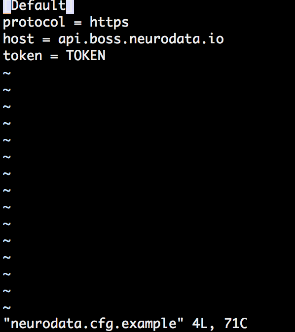
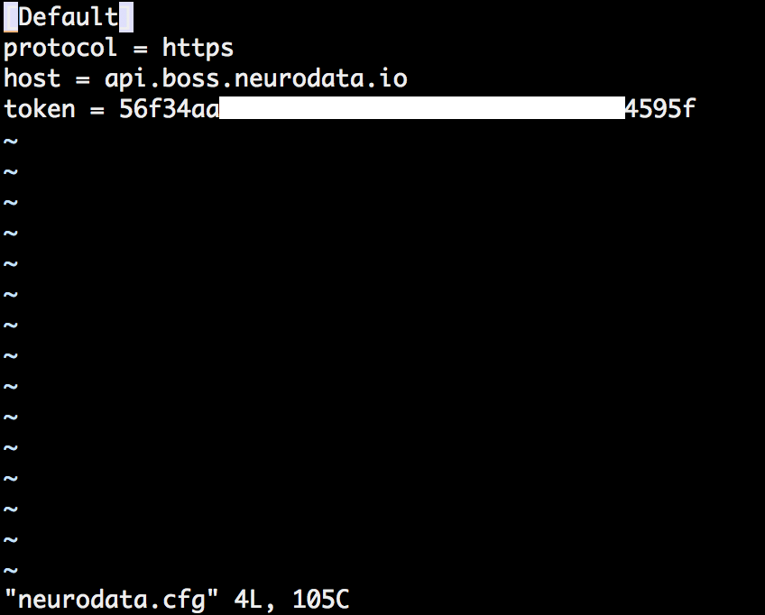

# Boss-Annotator
Software for Downloading and Uploading to the Boss.
# Installation:
## Setup
1. Clone this repository
2. pip3 install -r requirements.txt
3. Add your Token to neurodata.cfg.example, and rename it to neurodata.cfg

## Pulling Images
1. In the main directory containing run.py, run: `python3 run.py`
2. Open http://localhost:4000, fill out the forms for pulling and click the button.
3. If successful, you will see a success message. If not, information about what went wrong will appear.
4. The tif stack you pulled will be located in the DATA/ directory

## Annotating (exactly the same as in [V1 Documentation](http://neurodata-annotator.readthedocs.io/en/latest/))
1. Open FIJI
2. Annotate the image, taking the steps given in the link above.
3. Save the image with any name into the same DATA/ directory.

## Pushing Annotations
1. In the main directory containing run.py, run: `python3 run.py`
2. Open http://localhost:4000, fill out the forms for pushing and click the button.
3. If successful, you will see a success message. If not, information about what went wrong will appear.

## Documentation:
[V1 Documentation](http://neurodata-annotator.readthedocs.io/en/latest/))
